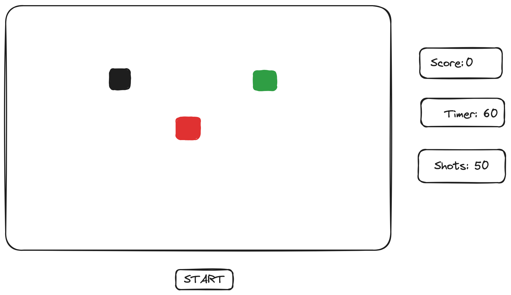
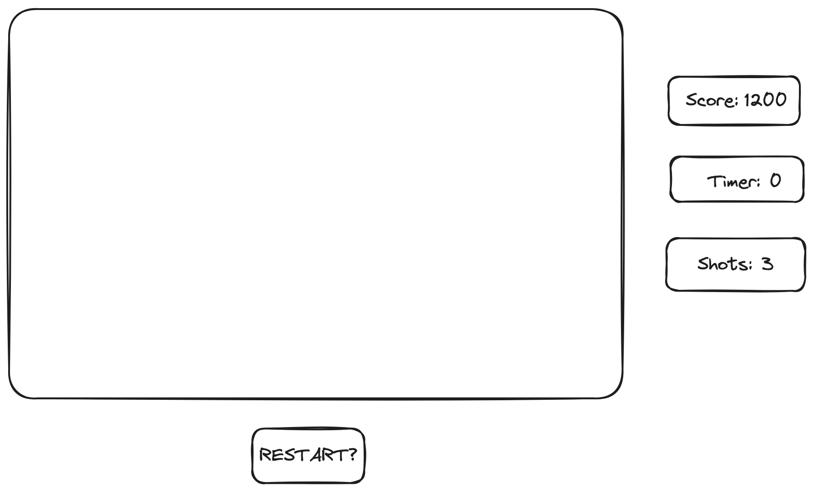

## Project Choice 

DUCK HUNT EMULATOR GAME

## Project Description 

My app is called Duck Hunt Emulator. It's a game app for players who want to go back in time and play the popular game in the 80s Duck Hunt. A player can join an online game and try to achieve the highest score, with the score being kept automatically and game results displayed at then end of each round and their total at the end of the game. The player will go againt many duck varients, some stronger and faster than the next, quite the challenge. Users will have the option to play again. In the future, I'd like to add a feature where one player can play against the computer and the data is stored in a database. 

## Wire Frames

**Initial Landing View**



--------------------------------------

**Results View**

--------------------------------------

## User Stories

#### MVP Goals

- As a player, I want to be able to start the game. with inital values
- when i click a pixel the pixel dissapears adding to my current score
- As a player I would like to see the pixel radnmly generate
- As a Player I should see the pixel grid board.
- As a player, I would like to keep track of my score.
- As a player I would like to be able to restart the game after a win, and my score is added to leader board.
- As a player, I want the UI to be engaging and out of the way so that I enjoy the experience of playing the game.

#### Stretch Goals

- As a player, I would like to be able to see my cross hairs and fire.
- As a player, I would like to be informed when I missed and if I lost my lives and when i won the round
- As a player, I would like to be able to see the leader board.
- As a player, I would like to see more animation like the home page and the gun itself 
- As a player, I would like to hear an audible sound when I hit a duck and a a miss sound when i miss a duck 
- As a player, I would like to play this game online so i can play against someone else and against the computer.
- As a player, I would like to have different firing tools that give me a better advantage.
- As a player, I would like to be informed when I missed and if I lost my lives and when i won the round.
- As, a player, I would like to see a endiing game over sign
- As a player I would like to have my information saved on a localStorage

## pseudocode
```
1) Define the required variables used to track the state of the game
    1a) a varible that actally start the game so the player is prepared
    1a) create a variable that creates the pixel board
    2b) create a variable that keeps track of score 
    3c) create a variable that keeps track of hit boxes left
    4d) keeps track of how many shots the player has left
    5e) Create a varible thats a timer for how long the game will last
    6f) Keep track of how many targets are currently on the board


init
render 
    tallyScore
    updateBoard

2) Store cached element references

    2a) A constant message for count down time representing the timer
    2b) A constant variable to represent the current score 
    2c) A constant variable to represent the final score when game is done and game over sign 
    2d) A const varible to display shots left

3) Upon loading, the game state should be initialized, and a function should be called to render this game state

     3a) Create a function called `init`.

   3b) Call this `init` function when the app loads.
  
    3c)!!!! Set the `pixel grid` variable to create the game board

   3d) Set the player `start`` to false until the player clicks the start button to set it to true and start the timer

   3e) set the `scrore` to 0

   3e) Set the `shots left` to 5

   3f) Set `timer` to 60 seconds.

   3g) Call a function called `render` at the end of the `init` function.


4) The state of the game should be rendered to the user

    4a) Create a function called `render`, then set it aside for now.

   4b) Create a function called `updateBoard`.

   4c) In the `updateBoard` function, loop over `board` and for each element:
       - if the pixel is there for too long the set changes to random postions on the board
       - OR when a pixel gets hit the board updates to keep track of how many pixel are left before placing the next set

   4d) Create a function called `updateMessage`
  
   4e) In the `updateMessage` function, render a message based on the 
       current game state:
       - to store the new state of the curretn score on each hit
    
       - If the timer finishes the final score is given
       - Otherwise, if the player runs out of shots the timer stops and the final score is given
        - if the timer reaches 0 aor the shots are depleted the player cant shoot anymore pixels

   4f) Invoke both the `updateBoard` and the `updateMessage` functions
         inside of your `render` function.


5) Define the required constants

 5a) The standard amount of pixels on the board for each set
 5b) Timer how much time the player has left
 5c) number of bullets
 5d) number of pixels

6) Handle a player clicking a square with a `handleClick` function

pixel has an id if the id is clicked then we remove the pixel from the page

7) Create Reset functionality

     7a) Add a reset button to the HTML document.

   7b) Store the new reset button element as a cached element reference in
     a constant named `resetBtnEl`.

   7c) Attach an event listener to the `resetBtnEl`. On the `'click'` event 
       it should call the `init` function you created in step 3 setting the start varible back to false

#### Notionboard Template
Notionboard template for building projects ( You can use this for any project )
https://www.notion.so/GA-Unit-3-Tunr-Lab-da2c82fafd4e4a7aa654676732db9ee3

#### Timeline - Daily Accountability
Timeline to keep organized 
https://www.tablesgenerator.com/markdown_tables

Do not neglect to plan, you will thank yourself later for being proactive!
| Day            | Done | Tasks                      | Blockers                         | Notes/Thoughts |
|----------------|------|----------------------------|----------------------------------|----------------|
| Thursday 11/31 |      | Create html, js, css files |                                  |                |
| Friday   12/1  |      | Make the Proposal          | Knowing the exact psudeocode     |                |
| Saturday. 12/2 |      | Make The Canvas / Images   |                                  | Get GPT IMAGES |
| Sunday  12/3   |      | Create Abstract Code       |                                  |                |
| Monday  12/4   |      | Make Functionality         | Target, and tracking             |                |
| Tuesday. 12/5  |      | Finialize MVP              |                                  |                |
| Wednesday 12/6 |      | Add Styling                |                                  |                |
| Thursday 12/7  |      | Work on Stretch Goals      | Need more time for functionality |                |
| Friday. 12/8   |      | Presentation Day!          |                                  |                |
